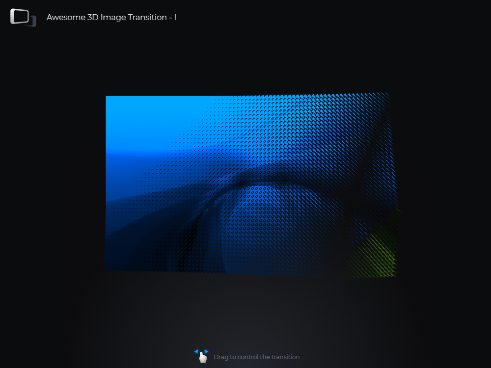

# Awesome 3D Image Transition 1 - Three.js

A smooth 3D image transition animation, achieved with three.js and WebGL.

Highlights:
- InstancedBufferGeometry
- Custom Shader Material
- Fully GPU optimized
- Touchscreen friendly

Demo - [g7495x.gitlab.io/awesome-3d-image-transition-1-three.js](https://g7495x.gitlab.io/awesome-3d-image-transition-1-three.js/)

